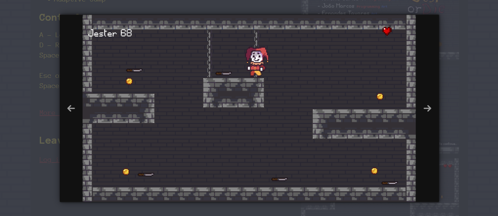

# JEST OR DIE
👨‍🏫JOGO 2D FEITO NA UNITY.

   

## DESCRIÇÃO:
O tolo deve agradar a alteza se quiser viver! Em "Jest or Die", você terá a experiência de um jogo de plataforma 2D com ação frenética, com o objetivo de sobreviver e fazer o rei rir.

O bobo deve gostar alteza caso queira viver! Em Jest or Die, você terá a experiência de um jogo de plataforma 2D de ação frenética, sobrevivendo e fazendo o rei rir.

## IMPORTANDO PARA A UNITY:
### MÉTODO 1: IMPORTAR VIA ASSET PACKAGE:
   - No Unity, vá para `Assets` > `Import Package` > `Custom Package`.
   - Navegue até o arquivo `.unitypackage` que você baixou e selecione-o.
   - Clique em `Import` para adicionar o conteúdo ao seu projeto.

### MÉTODO 2: COPIAR E COLAR MANUALMENTE:
1. **Copiar o Código e Assets:**
   - Extraia o conteúdo do repositório GitHub (se ainda não o fez) em uma pasta no seu computador.
   - Navegue até a pasta `./CODIGO/Assets` do seu projeto Unity.

2. **Adicionar o Conteúdo ao Projeto:**
   - Copie a pasta contendo o código e assets do repositório GitHub.
   - Cole a pasta na pasta `Assets` do seu projeto Unity. O Unity reconhecerá e importará automaticamente os arquivos.

### CONFIGURAR O PROJETO NO UNITY:
1. **Abrir a Cena Principal:**
   - No painel `Project`, vá para a pasta onde o código e assets foram importados. Procure por uma cena principal, normalmente chamada `MainScene`, `GameScene`, ou algo semelhante.
   - Clique duas vezes na cena para abri-la.

2. **Verificar e Ajustar Configurações:**
   - Certifique-se de que todos os scripts, prefabs e outros assets foram importados corretamente.
   - Se houver scripts que precisam de referências, você pode precisar arrastar e soltar esses objetos no `Inspector` para configurar as referências corretamente.
   
## NÃO SABE?
- Entendemos que para manipular arquivos em muitas linguagens e tecnologias relacionadas, é necessário possuir conhecimento nessas áreas. Para auxiliar nesse aprendizado, oferecemos cursos gratuitos disponíveis:
* [CURSO DE UNITY](https://github.com/VILHALVA/CURSO-DE-UNITY)
* [CURSO DE C#](https://github.com/VILHALVA/CURSO-DE-C-SHARP)
* [CONFIRA MAIS CURSOS](https://github.com/VILHALVA?tab=repositories&q=+topic:CURSO)

## CREDITOS:
- [PROJETO CRIADO PELO "romhenri"](https://github.com/romhenri/jest-or-die)
- [PROJETO EDITADO PELO VILHALVA](https://github.com/VILHALVA)
